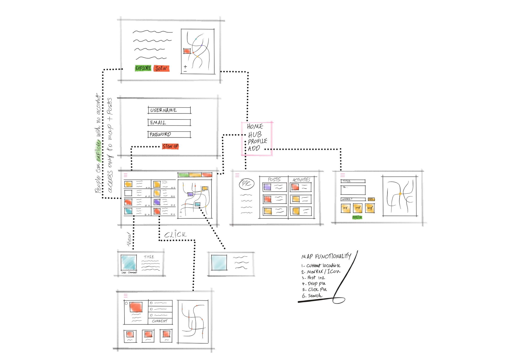
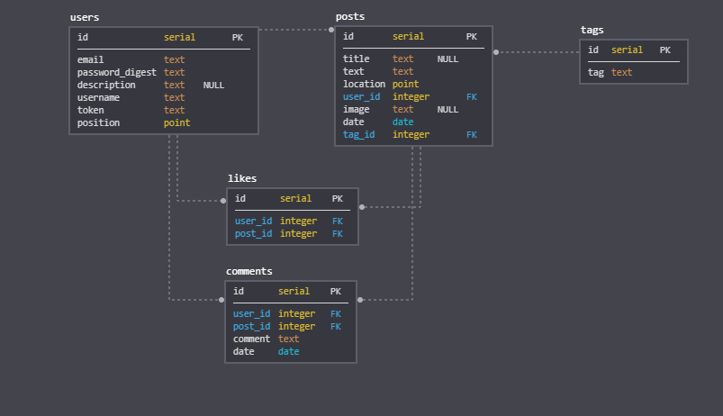

## `uraXa`

Tourism will be one of the slowest industries to recover post COVID-19. It impacts individuals, communities and travel industries.

uraXa map is a free community resource which provide locals with a simple way to connect to their communities, allow communities to support the travel industries and enhance the travel industries capabilities to offer online tourism.

## `Wireframe`





## `Settings`

Change Domain varibale in line30 App.js from `https://uraxa-api.herokuapp.com` to `http://localhost:8080` in order to run servers for development.

## `Launch`

To install back-end dependencies `cd` to the `backend` directory:

```
$ npm install
```

To install front-end dependencies `cd` to the `frontend` directory:

```
$ npm install
```

To run back-end server `cd` to the `backend` directory:

```
$ npm run dev
```

To run back-end server `cd` to the `frontend` directory:

```
$ npm start
```

## `Flow`

As a user with no account you can explore Cairns as the case study and see posts from the community. All users can signup and create an account based on their desired location. Once loged in, users can start exploring and adding their own stories in any location and contribute to the community.

## `LogIn`

Use any of details provided below to LogIn and experince the flow of the app.

Email: `trish@email.com`
Password: pass

Email: `terri@email.com`
Password: pass

Email: `rosha@email.com`
Password: pass

Email: `arne@email.com`
Password: pass

## `Technologies & Libraries`

- HERE map API
- React JS
- Node JS
- Express
- Lodash
- postgreSQL
- Postman
- Cloudinary
- Bcrypt
- Heroku
- Netlify
- CSS